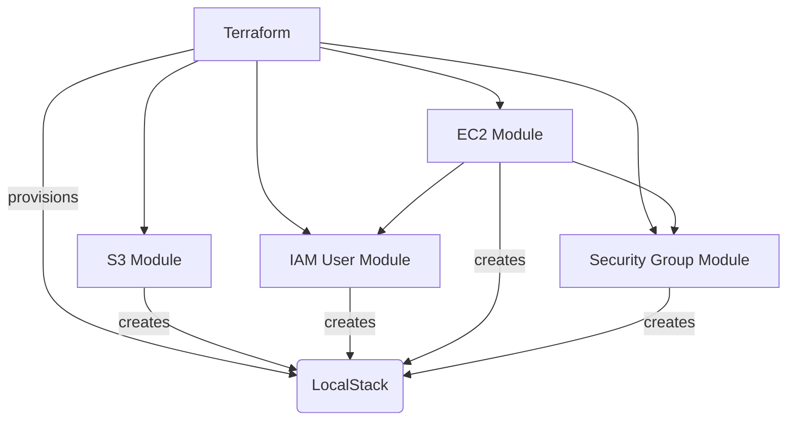

# AWS IaC Sandbox (Local Only)

This project lets you practice and showcase DevOps skills by provisioning AWS-like infrastructure locally using Terraform and LocalStack.

## Introduction
This project enables safe, cost-free, and repeatable infrastructure as code (IaC) development and testing—without touching real AWS!

---

## Architecture Diagram



*This diagram shows how Terraform uses modular code to provision resources in LocalStack. Modules are reusable and composable, and can reference each other or be used independently in example configs.*

---

## Purpose
- Use Infrastructure as Code (IaC) safely and freely
- Emulate AWS services (EC2, S3, IAM, etc.) with LocalStack
- Modular, reusable Terraform code

## Project Structure
- `terraform/` — Terraform configuration files
- `modules/` — Custom Terraform modules
- `scripts/` — Automation scripts

## Quick Start
1. Clone this repository
2. (Setup and usage instructions will be added as the project develops)

## AWS CLI Configuration for LocalStack

To interact with LocalStack using the AWS CLI, you must configure credentials—even though LocalStack does not validate them. You can set a dedicated profile with dummy values:

1. Run the following command:

```sh
aws configure --profile localstack
```

2. When prompted, enter:
- AWS Access Key ID: `test`
- AWS Secret Access Key: `test`
- Default region name: `eu-central-1`
- Default output format: `json` (or leave blank)

3. Use the profile in all AWS CLI commands targeting LocalStack:

```sh
aws --endpoint-url=http://localhost:4566 s3 ls --profile localstack
```

## LocalStack Usage

Start LocalStack (in the background):
```sh
docker-compose up -d
```

Stop LocalStack:
```sh
docker-compose down
```

- LocalStack will expose AWS-compatible endpoints on port 4566.
- Data will persist in the `localstack/` directory.
- You can view logs using:
```sh
docker-compose logs -f
```

## Extending LocalStack

To enable additional AWS services in LocalStack:

1. Edit the `SERVICES` environment variable in `docker-compose.yml`.
   - For example, to add Lambda and DynamoDB:
     ```yaml
     environment:
       - SERVICES=s3,ec2,iam,lambda,dynamodb
     ```
2. Save the file and restart LocalStack:
   ```sh
   docker-compose down
   docker-compose up -d
   ```

### IAM User vs. EC2 Role Modules: Why They're Separate

This project intentionally separates the IAM user module (for user/least-privilege demos) and the resources for EC2 IAM roles/profiles (used inline or in a dedicated module for EC2). This follows Terraform best-practice modularity:

- **IAM User Module:**
  - Used for creating users, policies, and least-privilege demos.
  - See `terraform/iam-example.tf` for usage.
- **EC2 IAM Role/Profile:**
  - Created inline in `terraform/ec2-example.tf` (or could be moved to a dedicated module).
  - Used for attaching roles to EC2 instances for AWS API access.

**Why?**
- IAM users and EC2 roles serve different purposes in AWS.
- Keeping modules focused and composable makes your IaC more reusable, testable, and portfolio-friendly.
- This structure demonstrates real-world modular Terraform patterns.